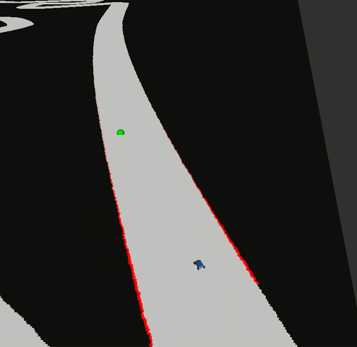
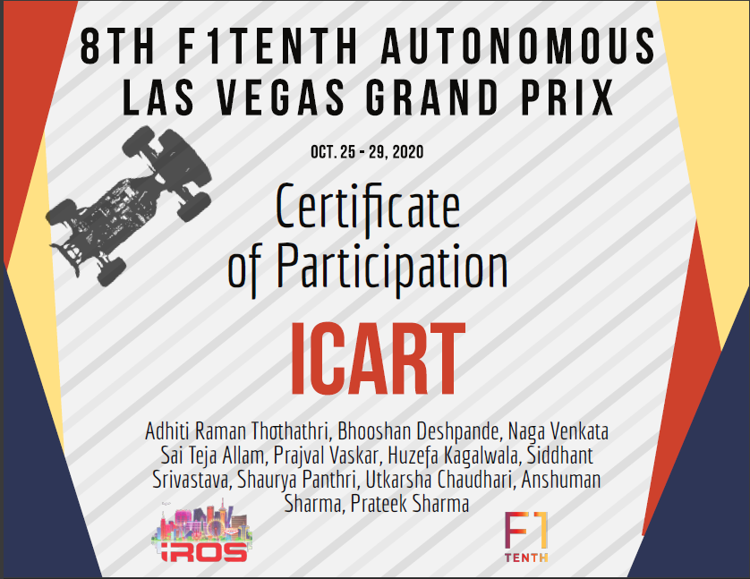

# IROS 2020 Submission for team iCart 
## University: Clemson University - International Center for Automotive Research
This is the submission folder for final RACE for IROS 2020. This code is an advanced version of disparity extender logic. It uses LIDAR readings to change vehicle perception and control the vehicle to follow the track. 

Code Script: `icart_pkg / src / iros_icart.py`

## Vehicle Performance on the race track (Snapshot) :

## Steps to run the code: 
1. Open terminal and run `$ roscore` 
2. On a seperate terminal run `$ rviz` 
3. On another terminla run `$ sudo ./start.sh`
4. Ego ID = icart_id
5. For debugging purposes, the pushed image runs after running start.sh file using the docker-compose.yaml settings as shown in the picture 'Docker-Compose-Settings.png'. Please contact us if any difficulty. 

## Team Members :
Bhooshan Deshpande (bhooshd@g.clsemson.edu), Adhiti Raman, Huzefa Kagalwala, Siddhant Srivastava, Anshuman Sharma, Naga Venkata Sai Teja Allam, Shaurya Panthri, Prateek Sharma, Prajval Vaskar, Utkarsha Chaudhari

Faculty Advisor :
Dr. Venkat N. Krovi

## Participation Certificate

## Map file - 

