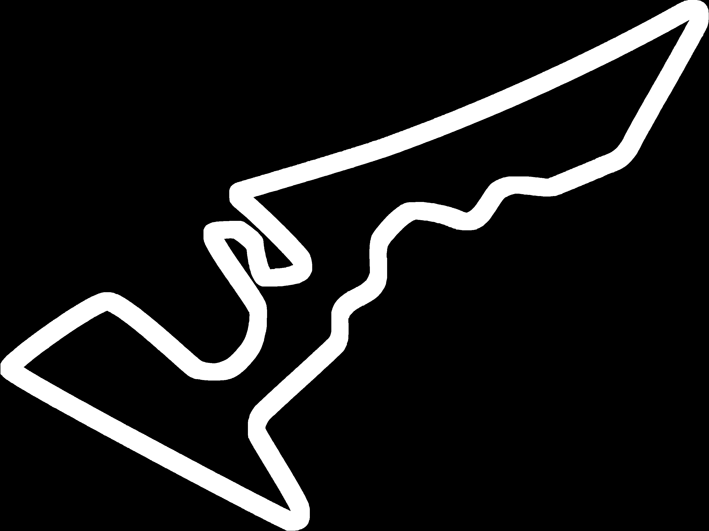

# Team Name: iCart

This is the submission folder for final RACE for IROS 2020. This code is an advanced version of disparity extender logic. It uses LIDAR readings to change vehicle perception and control the vehicle to follow the track. 

# University: Clemson University - International Center for Automotive Research

# Code Script: `icart_pkg / src / iros_icart.py`

# Map file - 

# Vehicle Performance on the race track (Snapshot) :

# Steps to run the code: 
1. Open terminal and run `$ roscore` 
2. On a seperate terminal run `$ rviz` 
3. On another terminla run `$ sudo ./start.sh`
4. Ego ID = icart_id
5. For debugging purposes, the pushed image runs after running start.sh file using the docker-compose.yaml settings as shown in the picture 'Docker-Compose-Settings.png'. Please contact us if any difficulty. 

# Team Members :
Adhiti Raman 
Bhooshan Deshpande (bhooshd@g.clsemson.edu) 
Huzefa Kagalwala
Siddhant Srivastava
Anshuman Sharma
Naga Venkata Sai Teja Allam
Shaurya Panthri
Prateek Sharma
Prajval Vaskar
Utkarsha Chaudhari

Faculty Advisor :
Dr. Venkat N. Krovi

